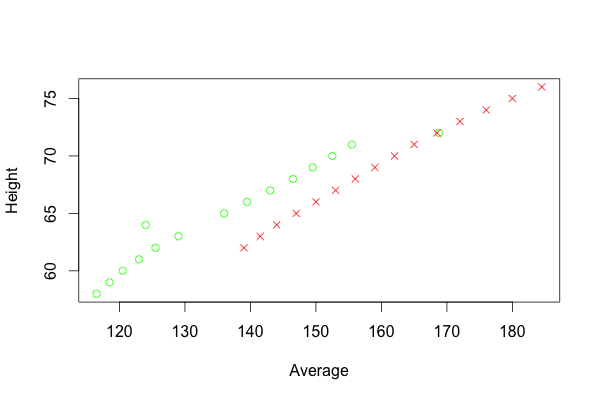
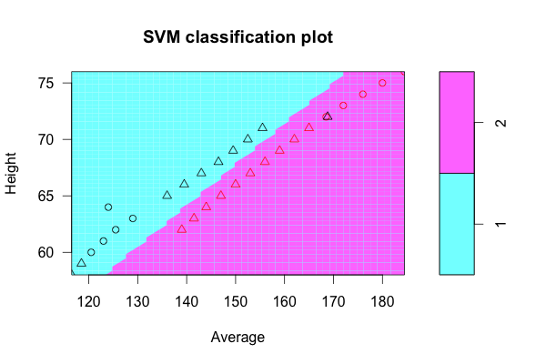

# SVM for Programmers, part 2

Let's start with a concrete example to taste a flavor of how SVM works.

body.data ([source site][1]) is the input file containing the statistical heights and weights of females and males. Here is the raw data:

[Source of body.data](support-vector-machine-for-programmers/body.data)

Then we can easily load the data to R and use libsvm to classify genders by heights and weights.

[Source of svm4p2.r](support-vector-machine-for-programmers/svm4p2.r)

Line 4 renders the picture of the data.



Line 8 renders the picture of how the svm classifying the data.



With the trained model m1, we can guess if a new person if male or female by his/her height and weight:

``` r
predict(m1, data.frame(Height=71, Average=155))
predict(m1, data.frame(Height=67, Average=175))
```

Results:

- Height 71in (180cm), Weight 155lbs (70kg) => -1 Female
- Height 67in (170cm), Weight 175lbs (79kg) => +1 Male

[1]: http://www.healthyyounaturally.com/nutrition/age_height_weight_chart.htm 
